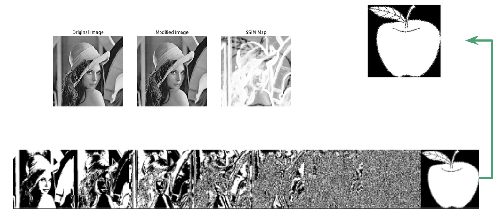

# 🕵️ Esteganografia PDI

## ℹ Tabela de Conteúdos
- [Descrição do Projeto](#dart-projeto-da-cadeira-de-processamento-digital-de-imagem-20241)
- [Especificações](#-especificações-do-projeto)

## :dart: Projeto da Cadeira de Processamento Digital de Imagem 2024.1

O Processamento Digital de Imagens (PDI) constitui um campo da ciência da computação dedicado à manipulação de imagens digitais por meio de algoritmos matemáticos sofisticados, abrindo um universo de possibilidades para analisá-las, aprimorá-las e extrair informações valiosas com alto grau de confiabilidade.
Este trabalho aprofunda os conhecimentos sobre a área de esteganografia, onde técnicas de análise e encripitação de mensagens em imagens são usadas. Os seguintes algoritmos são estudados: LSB, DCT, SSB4 e SSBN.

  

> Processo de identificação e extração de elementos escondidos em imagens.

## 📃 Especificações do Projeto

O projeto foi desenvolvido na linguagem Python utilizando o ambiente de desenvolvimento do [Goolge Colaboratory](https://colab.research.google.com/) e [Pycharm](https://www.jetbrains.com/pycharm/)

Visualize os scripts desenvolvidos para o projeto:
- [LSB](LSB)
- [DCT](DCT)
- [SSB](SSB)

## :man_technologist: Contribuidores

Trabalho realizado por:

<table>
  <tr>
    <td align="center">
      <a href="https://github.com/aleva90">
         
        
          <b>Alejandro López</b>
        
      </a>
    </td>
    <td align="center">
      <a href="https://github.com/LucasHenrique-dev">
         
        
          <b>Lucas Henrique</b>
        
      </a>
    </td>
    <td align="center">
      <a href="https://github.com/FelipeRomeroPachecoSegundo">
         
        
          <b>Felipe Romero</b>
        
      </a>
    </td>
  </tr>
</table>

## 📝 Licença

Esse projeto está sob licença. Veja o arquivo [LICENÇA](LICENSE) para mais detalhes.

[⬆ Voltar ao topo](#%EF%B8%8F-esteganografia-pdi) 
